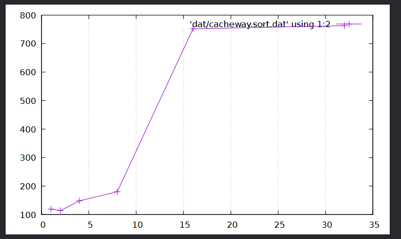

# NMV : Topologie mémoire

## Exercice 1

### Question 1

L'intérêt d'initialiser la nouvelle zone mémoire est de s'assurer que la ligne de cache correspondante soit en cache. Cela doit nous permettre d'avoir déjà des données en cache pour pouvoir mesurer de manière effective (à cause de l'allocation paresseuse qui ne va pas charger la zone mémoire dans le cache) le cache hit et le miss rate.

### Question 2

La boucle décrite doit générer les deux. Cependant, cela dépend de différents paramètres tel que la stratégie d'éviction, de précache, etc.

### Question 3

Lorsque _PARAM_ augmente, le taux de hit rate doit diminuer petit à petit. 
On devrait cependant observer plusieurs étapes :

- _PARAM_ << _CacheLineSize_ => Hit rate proche de 100%
- _PARAM_ <=~ _CacheLineSize_ => Hit rate proche de 50%, avec un plateau
- _PARAM_ >= _CacheLineSize_ => Hit rate tendant vers 0%, donc miss rate de 100%

### Question 4

Le nombre absolu de miss est constant jusqu'à ce que _PARAM_ = _CacheLineSize_ (on baisse le nombre de absolu de hit puisqu'on a un plus grand pas) => moins d'accès mémoire, donc moins de cache hit
Le temps d'exécution ne devrait augmenter qu'à partir de la 3ème étape.

### Question 5

La boucle principale est exécutée plusieurs fois afin d'éliminer le problème du bruit.

La phase de warmup est présente pour échauffer le préfetching du CPU, pour s'assurer que l'on ait des résultats déterministes

### Question 6

À partir de ce graphique, on peut en déduire que la taille d'une ligne de cache est de 64 bytes.

## Exercice 2

### Question 1

Lors de la première séquence, *MissRate* = *PARAM*/*CacheLineSize*. Lors des séquences d'accès suivantes, on n'aura pas de miss puisque les données seront entièrement chargées en cache.

### Question 2

Pour *PARAM* supérieur à *CacheLineSize*, on aura *MissRate = PARAM/CacheLineSize*, pour le premier ainsi que les accès suivants.

### Question 3

Pour *PARAM* inférieur à la *CacheLineSize*, le coût moyen sera de (*PARAM*/*CacheLineSize*) * (1/Pas)

Pour *PARAM* supérieur à la *CacheLineSize*, le coût moyen sera de (*PARAM*/*CacheLineSize*)

### Question 4

En théorie, on est sensé avoir une courbe tel que :

- Pour *PARAM* de 0 à CacheSize => plateau 

- Pour *PARAM* de *CacheSize* à 2 * *CacheSize* => courbe croissante

- Pour *PARAM* de 2 * *CacheSize* à l'infini (Taille totale du cache L1 en réalité) => plateau

Sur la courbe, la valeur à partir de laquelle on passe d'un plateau à un valeur croissante semblerait être 32k. Cette valeur est concordante avec les informations récupérées via `getconf`

## Exercice 3

### Question 1

Pour que toutes les lignes de caches modifiées appartiennent au même cache set, il faut que *SKIP_SIZE* soit un multiple de la taille du cache.

Ainsi, on aurait *SKIP_SIZE* = *CACHE_SIZE* modulo *CACHE_WAY*

Ainsi les données à l'index i modulo *SKIP_SIZE* auront le même cache set.

### Question 2

Pour générer seulement des miss, il faut que les valeurs auxquelles ont accèdent ne soient jamais dans le cache : autrement dit qu'elles aient le même cache set et qu'elles aient déjà été évictée.

Pour s'assurer de cela, le minimum d'un cache set étant 1, on doit faire *N* écriture, tel que *N* = *CACHE_SIZE* / *CACHE_LINE_SIZE*

### Question 3

On remarque que la charge commence à augmenter massivement entre 5 et 10 (7 ou 8). C'est-à-dire que le cache n'est plus du tout utilisé. Après vérification avec `getconf`, on peut vérifier cela : j'ai un processeur avec une associativité de 8 en L1.

## Exercice 4

### Question 1

Pour déterminer les paires de cœurs logiques, il est possible de faire tourner des opérations complexes (comme une division ou une racine carré) pour voir quels sont les cœurs plus rapides (grâce au partage du cache).

Pas de résultat probant optenu par manque de temps.
